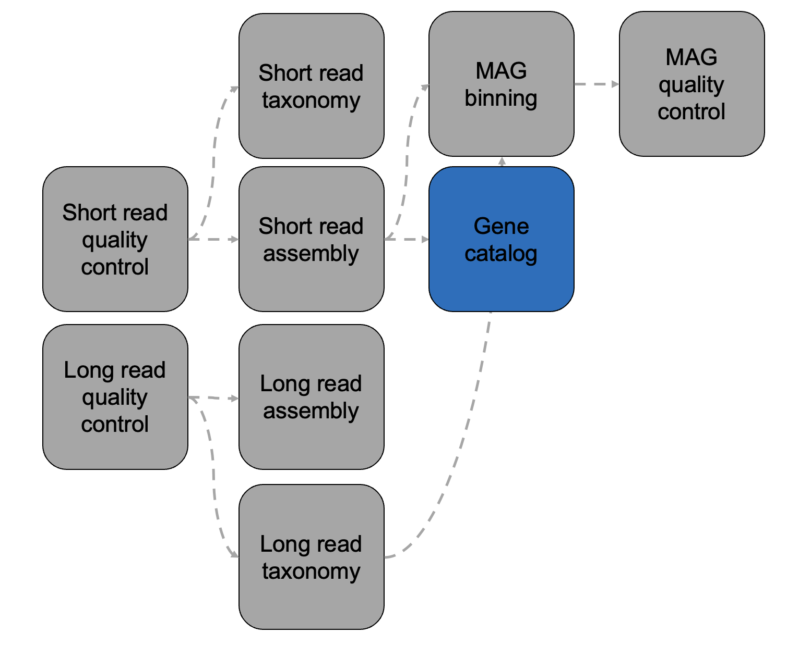

Gene Catalog
============

Overview
--------

This module generates and functionally annotates a gene catalog from assembled contigs. It is both self-contained (ex. instructions included for the setup of a versioned environment, etc.), and compatible with other CAMP modules (ex. ingests and spawns standardized input/output config files, etc.). 



Approach
--------
<INSERT PIPELINE IMAGE>

Installation
------------

1. Clone repo from `Github tutorial <https://github.com/MetaSUB-CAMP/camp_gene-catalog>`.

2. Set up the conda environment using ``configs/conda/gene-catalog.yaml``. 
```
cd camp_short-read-quality-control
conda env create -f configs/conda/gene-catalog.yaml
conda activate gene-catalog
```
3. AFTER activating the conda environment, download the bakta databases to a directory of your choosing. Make sure you update the parameters.yaml file with its location. Use absolute (not relative) paths when downloading the bakta dbs.

```
bakta_db download --output /path/to/bakta/db
amrfinder_update --database full/path/to/bakta/db/amrfinderplus-db
```
4. Test everything
```
pytest .tests/unit/
```    

Quickstart
----------

Running each CAMP module takes the same three steps, listed below.

1. As with all CAMP modules, update the parameters.yaml file:

<TABLE OF PARAMETERS AND DESCRIPTIONS>

2. Generate your samples.csv file in the following format:

<SAMPLES.CSV FORMAT>

3. Deploy!

<SNAKEMAKE COMMAND>

Module details
-------------------------------

**Input**: ``/path/to/samples.csv`` provided by the user.

**Output**: 1) An output config file summarizing the locations of the error-corrected FastQs, 2) the MultiQC report summarizing the properties for the QC-ed FastQ, and 3) summary statistics about the dataset after each error correction step indicating how many reads and/or bases were pruned

- ``/path/to/work/dir/short_read_qc/final_reports/samples.csv`` for ingestion by the next module

- ``/path/to/work/dir/short_read_qc/final_reports/*_multiqc_report.html``, where ``*`` is 'pre' or 'post'-module

- ``/path/to/work/dir/short_read_qc/final_reports/read_stats.csv``


**Structure**:
```
└── workflow
    ├── Snakefile
    ├── gene-catalog.py
    ├── utils.py
    └── __init__.py
```
- ``workflow/gene-catalog.py``: Click-based CLI that wraps the ``snakemake`` and unit test generation commands for clean management of parameters, resources, and environment variables.
- ``workflow/Snakefile``: The ``snakemake`` pipeline. 
- ``workflow/utils.py``: Sample ingestion and work directory setup functions, and other utility functions used in the pipeline and the CLI.

XXXXXXX

Command line deployment
-----------------------
To run CAMP on the command line, use the following, where ``/path/to/work/dir`` is replaced with the absolute path of your chosen working directory, and ``/path/to/samples.csv`` is replaced with your copy of ``samples.csv``. 
    - The default number of cores available to Snakemake is 1 which is enough for test data, but should probably be adjusted to 10+ for a real dataset.
    - Relative or absolute paths to the Snakefile and/or the working directory (if you're running elsewhere) are accepted!
```
python /path/to/camp_gene-catalog/workflow/gene-catalog.py -d /path/to/work/dir -s /path/to/samples.csv
```

* Note: This setup allows the main Snakefile to live outside of the work directory.

Running on a slurm cluster
--------------------------
To run CAMP on a job submission cluster (for now, only Slurm is supported), use the following.
    - ``--slurm`` is an optional flag that submits all rules in the Snakemake pipeline as ``sbatch`` jobs. 
    - In Slurm mode, the ``-c`` flag refers to the maximum number of ``sbatch`` jobs submitted in parallel, **not** the pool of cores available to run the jobs. Each job will request the number of cores specified by threads in ``configs/resources/slurm.yaml``.
```
    sbatch -J jobname -o jobname.log << "EOF"
    #!/bin/bash
    python /path/to/camp_gene-catalog/workflow/gene-catalog.py --slurm \
        (-c max_number_of_parallel_jobs_submitted) \
        -d /path/to/work/dir \
        -s /path/to/samples.csv
    EOF
```

Dependencies
------------
<LIST ALL DEPENDENCIES>

Credits
-------

* This package was created with `Cookiecutter <https://github.com/cookiecutter/cookiecutter>`_ as a simplified version of the `project template <https://github.com/audreyr/cookiecutter-pypackage>`_.
* Free software: MIT
* Documentation: https://short-read-quality-control.readthedocs.io. 


