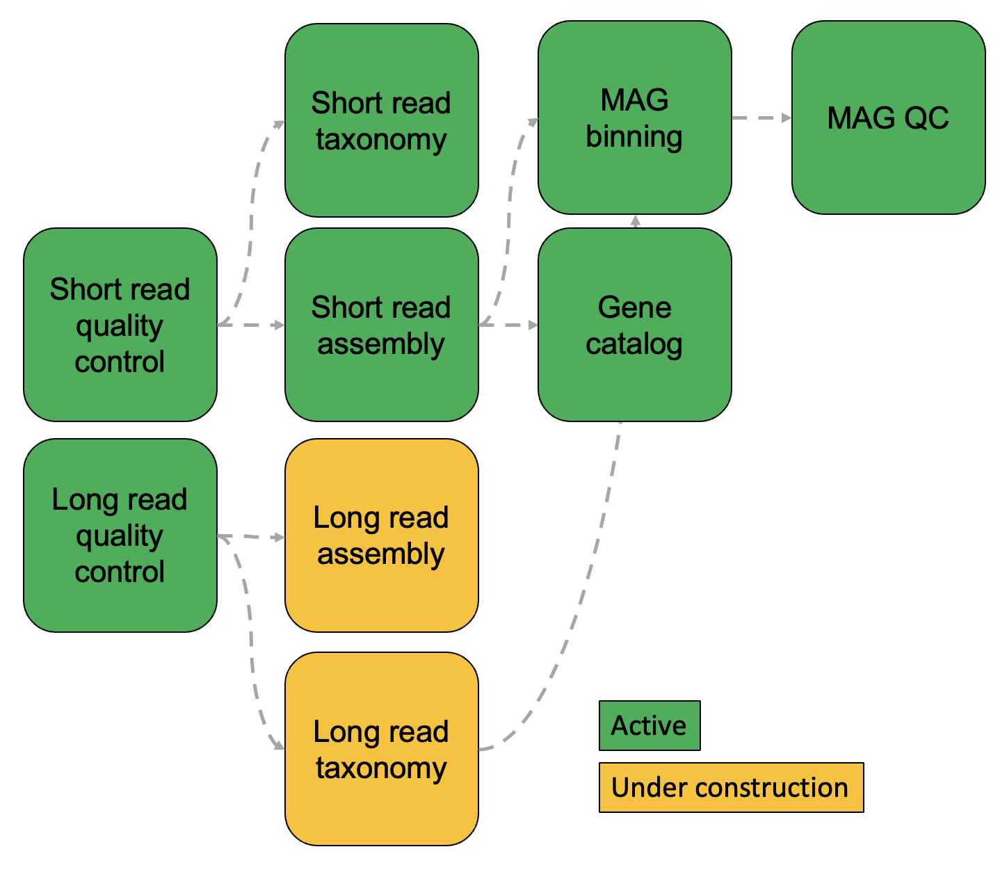

Welcome to the CAMP!
================

The MetaSUB Core Modular Analysis Pipeline, the **CAMP**, is a software toolkit designed for dynamic and educational analyses of metagenomes, bacterial isolates, and, in general, all things microbial. It is the primary analytic workflow for the  `MetaSUB consortium <https://metasub.org>`_.

The core philosophy of the CAMP is anchored in **modularity**, which is meant to stand in stark contrast to the popular bioinformatic toolkits of "one-click pipelines." By defining every step in an analytic workflow as single, consistently documented and parameterized codebase, we aim to enable users to gain total control over and a deep understand of their bioinformatic analyses. For more information on our design philosophy, check out the :doc:`background` section.

Notifications about CAMP releases will be available through the `MetaSUB Twitter account  <https://twitter.com/metasub?lang=en>`_.

Please post questions and issues related to CAMP tools on the GitHub repository of the specific module in question.

.. note::

   The CAMP is under active development.

Citing the CAMP
==============
If you use the CAMP, please site it (as well as the software it wraps!) as described in :ref:`references`.

.. toctree::
   :caption: Getting started
   :maxdepth: 1

   background.rst
   installation.rst

.. toctree::
   :caption: The CAMP modules
   :maxdepth: 1

   shortreadqc/index.md
   shortreadtax/index.md
   shortreadassembly/index.md
   genecatalog/index.md
   binning.rst
   nanoporeqc.rst
   magqc.rst

.. toctree::
   :caption: Developing for the CAMP
   :maxdepth: 1

   modulecreation/index.md
   upcomingmodules/index.md

.. toctree::
   :caption: References
   :maxdepth: 1

   references.rst
